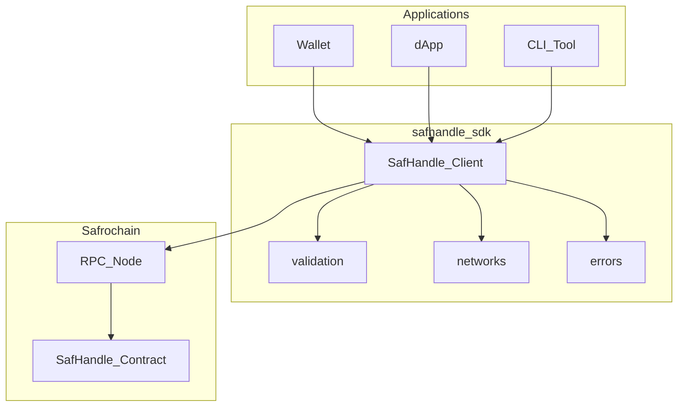

# SDK Architecture

How `@safrochain/safhandle` connects applications to the on-chain SafHandle registry.

## Layer diagram



## Module layout (target)

```text
src/
├── index.ts           # Public exports
├── client.ts          # SafHandle class
├── queries.ts         # CosmWasm query helpers
├── execute.ts         # CosmWasm execute + signing
├── validation.ts      # Name/phone/address validation
├── errors.ts          # Typed error classes
└── networks/
    ├── index.ts
    ├── testnet.ts
    └── mainnet.ts
```

## Dependencies (target)

| Package | Purpose |
| --- | --- |
| `@cosmjs/cosmwasm-stargate` | Contract queries and executes |
| `@cosmjs/stargate` | Signing client |
| `@cosmjs/amino` | Amino encoding |

Zero runtime dependencies beyond CosmJS is a design goal.

## Query path

1. `SafHandle.getAddress(input)` classifies input (name vs phone vs address)
2. `validation.ts` normalizes input
3. `queries.ts` builds `QueryMsg` JSON
4. `CosmWasmClient.queryContractSmart()` calls chain
5. Response mapped to `ResolveResult`

## Execute path

1. User provides `OfflineSigner` from wallet
2. `execute.ts` builds `ExecuteMsg` + fee `Coin`
3. `SigningCosmWasmClient.execute()` submits tx
4. Returns `TxResult` with hash and height

## Config loading

Network JSON from [config/](../config/) is bundled at build time. Environment variables override at runtime.

## Version compatibility

| SDK version | Contract version | Notes |
| --- | --- | --- |
| 0.0.x | spec only | Documentation phase |
| 0.1.x | v1.0.0 | Initial testnet |

SDK major version bumps when contract API has breaking changes.

## Related

- [Contract ARCHITECTURE](https://github.com/Safrochain-Org/safhandle-contract/blob/main/docs/ARCHITECTURE.md)
- [API_REFERENCE.md](./API_REFERENCE.md)
