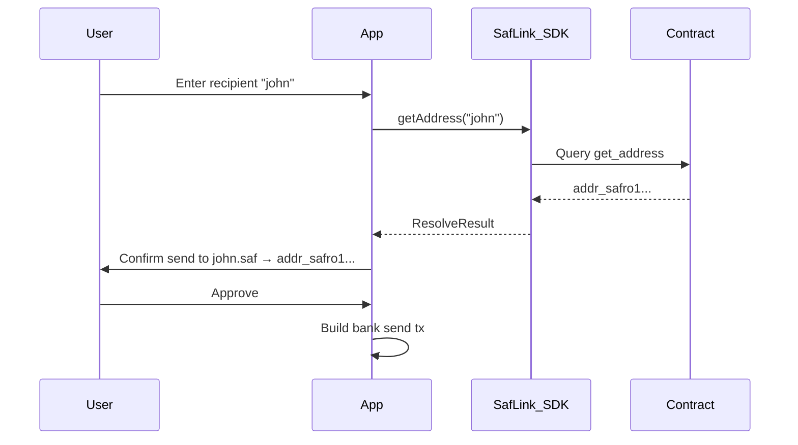

# Integration Guide

Patterns for integrating SAFLink into dApps, payment flows, and Safrochain ecosystem apps.

## Resolution in send flows

Every send-by-name flow should follow this pattern:



### Always confirm resolved address

Display both the human-readable identifier **and** the resolved `addr_safro` address before the user signs. Never send without user confirmation.

## Safroutine Hub integration

| Feature | SDK usage |
| --- | --- |
| User profile `@john.saf` | `getAddress` for display; cache with TTL |
| Send to contact | Resolve name before `MsgSend` |
| Register name on signup | `registerName` after wallet connect |

## Payment checkout

Merchants can display a short name instead of QR-encoded addresses:

1. Merchant registers `shopname.saf`
2. Checkout page shows "Pay shopname.saf"
3. Customer wallet resolves and pays

## Caching recommendations

| Data | Cache TTL | Invalidation |
| --- | --- | --- |
| Name resolution | 60 seconds | On send confirmation |
| Config (fees) | 5 minutes | On registration UI open |
| Phone verification status | 30 seconds | Never cache across sends |

**Do not cache indefinitely.** Stale resolution is a funds-loss risk if the owner transfers the name.

## Batch resolution

For contact lists, batch queries reduce RPC load:

```typescript
// Future API
const results = await safLink.batchGetAddress(['john', 'alice', '+243899123456']);
```

## Registration UX

| Step | UX recommendation |
| --- | --- |
| Name input | Live validation with `isValidName()` |
| Fee display | Show "50 SAF" not "50000000 usaf" |
| Success | Show registered name + link to explorer |
| Phone link | Warn that number is public on-chain |

## Read-only vs signing

| Mode | Methods | Use case |
| --- | --- | --- |
| Read-only | `getAddress`, `getConfig` | Explorers, read-only dashboards |
| Signing | `registerName`, `linkPhone`, etc. | Wallets, registration flows |

Read-only mode needs only RPC access — no wallet required.

## Related

- [WALLET_INTEGRATION.md](./WALLET_INTEGRATION.md)
- [ERROR_HANDLING.md](./ERROR_HANDLING.md)
- [Contract HOW_IT_WORKS](https://github.com/Safrochain-Org/saflink-contract/blob/main/docs/HOW_IT_WORKS.md)
