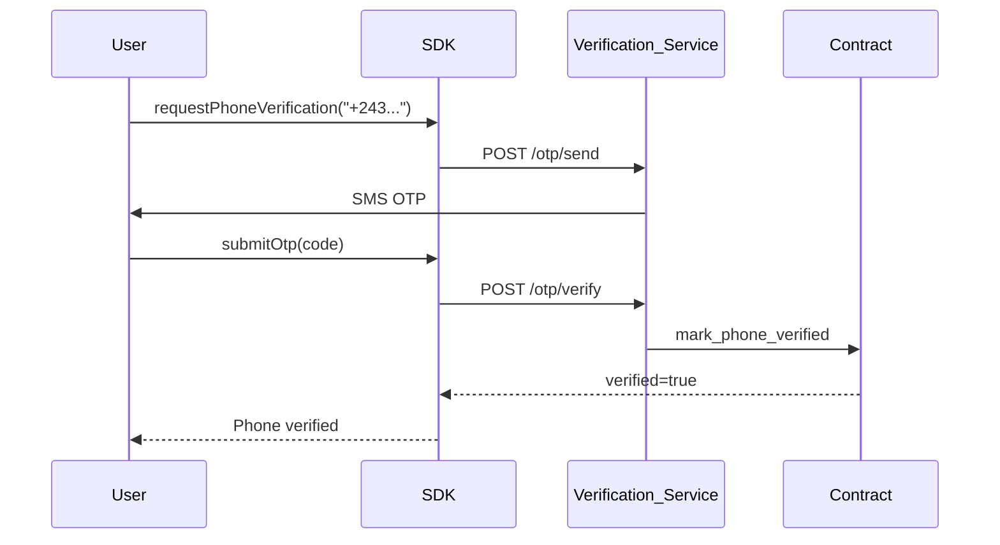

# Phone Verification (Phase 2)

Off-chain mobile number verification for SAFLink phone links. Phase 1 stores phones on-chain with `verified: false`. Phase 2 adds OTP-based proof.

## Phase 1 behavior

| State | Resolution | Wallet UX |
| --- | --- | --- |
| Registered, unverified | Works | Show warning badge |
| Registered, verified | Works | Show verified badge |
| Not registered | Error | Prompt to check number |

## Phase 2 flow



## SDK methods (Phase 2)

```typescript
// Request OTP (off-chain)
await safLink.requestPhoneVerification('+243899123456');

// Submit OTP code
await safLink.submitPhoneVerification('+243899123456', '123456');

// Poll status
const status = await safLink.getPhoneVerificationStatus('+243899123456');
// { verified: true, verifiedAt: '2027-01-15T...' }
```

## On-chain status flags

From `getAddress` / `resolvePhone`:

```typescript
interface ResolveResult {
  verified: boolean | null;  // null for names
}
```

Contract stores `verified_at_time` when attestation succeeds. See [contract PHONE_LINKING.md](https://github.com/Safrochain-Org/saflink-contract/blob/main/docs/PHONE_LINKING.md).

## Privacy

| Data | Stored where |
| --- | --- |
| E.164 phone | On-chain (public) |
| OTP codes | Verifier service only (ephemeral) |
| SMS content | Never on-chain |

Inform users that phone numbers are publicly visible on the blockchain before linking.

## Verifier authorization

Only governance-approved verifier addresses may call `mark_phone_verified` on the contract. The SDK talks to the verifier service, not directly to the contract for OTP validation.

## Error handling

| Error | Meaning |
| --- | --- |
| `VerificationPendingError` | OTP sent, awaiting code |
| `VerificationFailedError` | Wrong or expired OTP |
| `VerificationRateLimitError` | Too many OTP requests |

## Related

- [ERROR_HANDLING.md](./ERROR_HANDLING.md)
- [WALLET_INTEGRATION.md](./WALLET_INTEGRATION.md)
