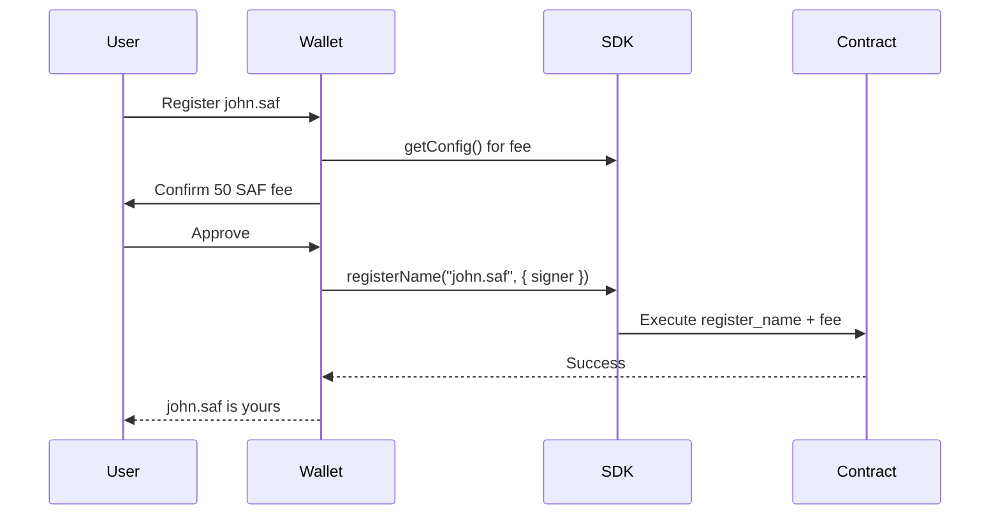

# Wallet Integration

Guide for Safrochain wallet developers integrating SAFLink name resolution and registration.

## Supported wallets (target)

Any Cosmos wallet supporting Safrochain (`addr_safro`, chain ID `safrochain-1` / `safro-testnet-1`) with CosmWasm query capability.

| Wallet | Integration path |
| --- | --- |
| Keplr | `@cosmjs/cosmwasm-stargate` + SAFLink SDK |
| Leap | Same as Keplr |
| Custom Safrochain wallet | Native SDK or direct CosmWasm queries |

## Send flow integration

### 1. Detect input type

```typescript
import { isValidPhone, isValidName } from '@safrochain/saflink';

function classifyInput(input: string) {
  if (input.startsWith('+') && isValidPhone(input)) return 'phone';
  if (isValidName(input) || !input.startsWith('addr_safro')) return 'name';
  return 'address';
}
```

### 2. Resolve before send

```typescript
const safLink = new SafLink({ network: currentNetwork });

if (type === 'name' || type === 'phone') {
  const { address, verified } = await safLink.getAddress(input);
  if (type === 'phone' && verified === false) {
    showWarning('This phone number is not verified.');
  }
  recipientAddress = address;
}
```

### 3. Show confirmation screen

```
Send 10 SAF to
  john.saf
  addr_safro1abc...xyz

[Confirm] [Cancel]
```

## Registration flow



## Chain configuration

Add SAFLink contract to wallet chain registry:

```json
{
  "chainId": "safro-testnet-1",
  "bech32Prefix": "addr_safro",
  "saflink": {
    "contractAddress": "addr_safro1...",
    "nameFeeDisplay": "50 SAF",
    "phoneFeeDisplay": "100 SAF"
  }
}
```

## CosmJS direct query (without SDK)

For minimal integration before SDK publish:

```typescript
import { CosmWasmClient } from '@cosmjs/cosmwasm-stargate';

const result = await client.queryContractSmart(contractAddr, {
  get_address: { input: 'john' },
});
```

Prefer the SDK for normalization, error types, and version compatibility.

## Security checklist for wallets

- [ ] Always show resolved address before sign
- [ ] Warn on unverified phone numbers
- [ ] Do not cache resolutions across send sessions
- [ ] Validate fee amount matches `getConfig()` before sign
- [ ] Pin contract address per network (prevent phishing contracts)

## Related

- [API_REFERENCE.md](./API_REFERENCE.md)
- [examples/browser-wallet](../examples/browser-wallet/README.md)
