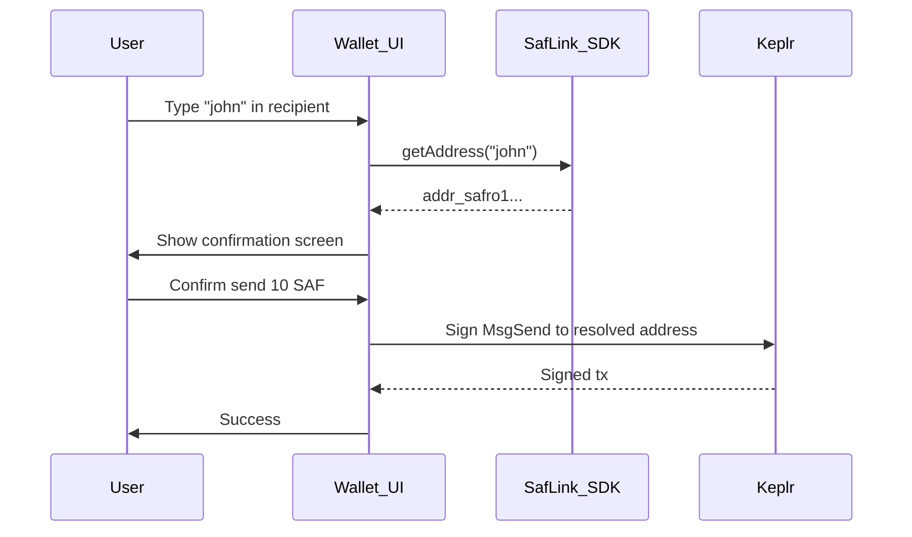

# Example: Browser Wallet Send Flow

Integrate SAFLink resolution into a browser wallet send screen. Markdown walkthrough for the target UX.

## Goal

User types `john` in the recipient field; wallet resolves to `addr_safro1...` before signing `MsgSend`.

## Flow



## UI mockup (conceptual)

```
┌─────────────────────────────────────┐
│  Send SAF                           │
├─────────────────────────────────────┤
│  To: [ john.saf              ] [↻]   │
│                                     │
│  Resolves to:                       │
│  addr_safro1abc...xyz               │
│                                     │
│  Amount: [ 10        ] SAF          │
│                                     │
│  [        Confirm Send        ]     │
└─────────────────────────────────────┘
```

## Implementation notes

### Debounce resolution

Wait 300ms after user stops typing before calling `getAddress()` to reduce RPC calls.

### Loading state

Show spinner while resolving. Disable Confirm until resolution succeeds.

### Phone warning

If `recordType === 'phone' && verified === false`, show amber banner:

> This phone number is not verified. Confirm the recipient is correct.

### Direct address bypass

If input starts with `addr_safro`, skip resolution and validate with `isSafroAddress()`.

## Code sketch (future)

```typescript
const [recipient, setRecipient] = useState('');
const [resolved, setResolved] = useState<ResolveResult | null>(null);

useEffect(() => {
  const timer = setTimeout(async () => {
    if (!recipient) return;
    const result = await safLink.getAddress(recipient);
    setResolved(result);
  }, 300);
  return () => clearTimeout(timer);
}, [recipient]);
```

## Related

- [WALLET_INTEGRATION.md](../../docs/WALLET_INTEGRATION.md)
- [INTEGRATION_GUIDE.md](../../docs/INTEGRATION_GUIDE.md)
